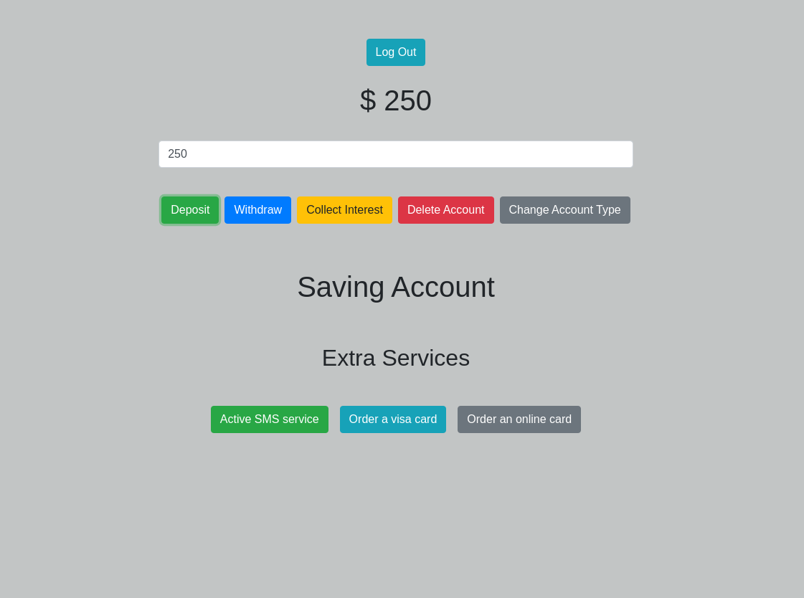

# bank-account

> React app fake bank account allows the user to deposit , withdraw , collect interest , delete account , change the account type, login log out and active extra features

## Table of contents

- [General info](#general-info)
- [Screenshots](#screenshots)
- [Technologies](#technologies)
- [Setup](#setup)
- [Features](#features)
- [Status](#status)
- [Inspiration](#inspiration)
- [Contact](#contact)

## General info

> A React app , the objective using Redux to mange the global state(store) and integrated with React

## Screenshots



## Technologies

- VS code
- React 17.0.2
- Redux 4.0.5
- React-redux 7.2.3

## Setup

- `npm install `
- `npm start`

## Code Examples

```js
import React, { useState } from "react";
import { useDispatch } from "react-redux";
// action creators
import {
  deposit,
  withdraw,
  collectInterest,
  deleteAccount,
  toggleAccount,
} from "../redux/actions/bankingActions";

const Banking = () => {
  //local state balance
  const [balance, setBalance] = useState("");
  const dispatch = useDispatch();
  const intBalance = parseInt(balance);

  // deposit
  const handleDeposit = () => {
    dispatch(deposit(intBalance));
  };
  // withdraw
  const handleWithdraw = () => {
    dispatch(withdraw(intBalance));
  };
  // collect interest
  const handleCollectInterest = () => {
    dispatch(collectInterest());
  };
  // delete account
  const handleDelete = () => {
    dispatch(deleteAccount());
  };
  //account type changer
  const handleAccountType = () => {
    dispatch(toggleAccount());
  };

  return (
    <div className="form-group">
      <input
        value={balance}
        onChange={(e) => setBalance(e.target.value)}
        type="text"
        className="form-control mt-4 mb-4 "
      />
      <button
        onClick={handleDeposit}
        className="btn btn-success mt-3 mr-1 ml-1"
      >
        Deposit
      </button>
      <button
        onClick={handleWithdraw}
        className="btn btn-primary mt-3 mr-1 ml-1"
      >
        Withdraw
      </button>
      <button
        onClick={handleCollectInterest}
        className="btn btn-warning mt-3 mr-1 ml-1"
      >
        Collect Interest
      </button>
      <button onClick={handleDelete} className="btn btn-danger mt-3 mr-1 ml-1">
        Delete Account{" "}
      </button>
      <button
        onClick={handleAccountType}
        className="btn btn-secondary mt-3 mr-1 ml-1"
      >
        Change Account Type
      </button>
    </div>
  );
};

export default Banking;
```

## Features

List of features ready and Todos for future development

-
-
-

To-do list:

-
-

## Status

Project is: _in progress_

## Inspiration

Redux by Thiyagarajan

## Contact

By [samirm00]
